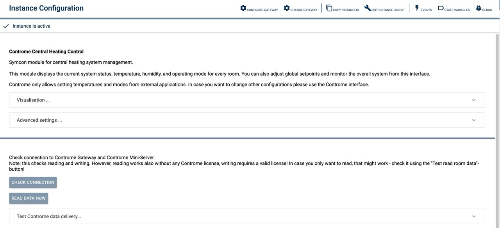
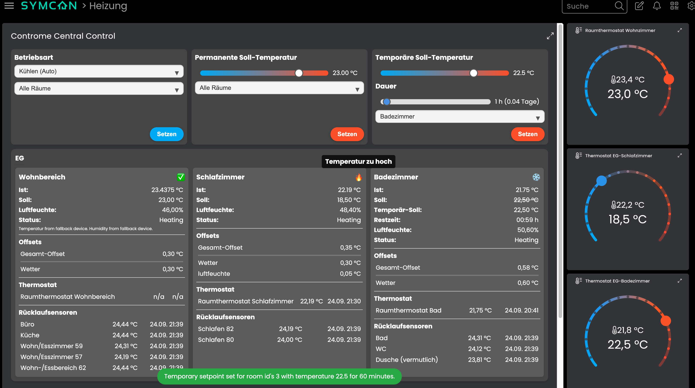

# ContromeCentralControl

Module description: Central control for Controme heating systems in IP-Symcon.

## Table of Contents

1. [Features](#1-features)
2. [Requirements](#2-requirements)
3. [Installation](#3-installation)
4. [Instance Setup in IP-Symcon](#4-instance-setup-in-ip-symcon)
5. [Status Variables and Profiles](#5-status-variables-and-profiles)
6. [Visualization](#6-visualization)
7. [PHP Command Reference](#7-php-command-reference)
8. [License](#8-license)

## 1. Features

- Set operation mode
- Set (permanent) setpoints
- Set temporary setpoints

## 2. Requirements

- IP-Symcon version 7.1 or higher
- Controme API license

## 3. Installation

- Install the 'Controme Heating Control' module via the Module Store.
- Alternatively, add the following URL in Module Control: https://github.com/AllardLiao/ContromeHeatingControl.git

## 4. Instance Setup in IP-Symcon

You can find the 'ContromeCentralControl' instance using the quick filter under 'Add Instance'.
Alternatively, you can create it via the Controme Gateway configuration form.

For more information on adding instances, see the [IP-Symcon documentation](https://www.symcon.de/service/dokumentation/konzepte/instanzen/#Instanz_hinzufügen).

__Configuration Page__:

| Name                | Description                                                                 |
|---------------------|-----------------------------------------------------------------------------|
| Permissions         | Permissions set for this instance
| Visualisation...    | Defines how the visualization tile will look and what data will be displayed|
| Advanced Settings...| Automatic updates and their interval                                        |

## 5. Status Variables and Profiles

Status variables are created automatically. Deleting individual variables may cause malfunctions.

## 6. Visualization

### 7. PHP-Befehlsreferenz

* `string CONCC_CheckConnection();`
Checks the connection to the Controme Gateway (IPS) and the Controme Mini-Server.

Beispiel:
`CONCC_CheckConnection();`

Returns JSON:
{
    "success" => success/fail
    "msg" => Information message
    "payload" => addtl. information
}

* `string CONCC_SetRoomTemperature();`
Checks the connection to the Controme Gateway (IPS) and the Controme Mini-Server.

Parameters:
array ["RoomIDs" => ['IDs'], "Target" => temperature]
Note: IDs again is an array.

Beispiel:
`CONCC_SetRoomTemperature(["RoomIDs" => [1, 2, 3], "Target" => 22.1]);`

Returns JSON:
{
    "success" => success/fail
    "msg" => Information message
    "payload" => addtl. information
}

* `string CONCC_setRoomTemperatureTemp();`
Checks the connection to the Controme Gateway (IPS) and the Controme Mini-Server.

Parameters:
array ["RoomIDs" => ['IDs'], "Target" => temperature, 'Duration" => duration in minutes]
Note: IDs again is an array.

Beispiel:
`CONCC_SetRoomTemperatureTemp(["RoomIDs" => [1], "Target" => 24.0, 180]);`

Returns JSON:
{
    "success" => success/fail
    "msg" => Information message
    "payload" => addtl. information
}

* `string CONCC_setRoomMode();`
Checks the connection to the Controme Gateway (IPS) and the Controme Mini-Server.

Parameters:
array ["RoomIDs" => ['IDs'], "ModeID" => 1]
Note: IDs again is an array. ModeID 0..3 (0-Kühlen, 1-Aus, 2-Heizen, 3-An)

Beispiel:
`CONCC_setRoomMode(["RoomIDs" => [1], "ModeID" => 2]);`

Returns JSON:
{
    "success" => success/fail
    "msg" => Information message
    "payload" => addtl. information
}

NOTE: Currently (Oct 2025) there is a bug in the API implementation of setting the operation mode.
The mode is set and understood by the Controme Mini-Server, however after setting the mode, the API returns
the int values from the API and not (as documented and normally) the string representation.
After loading the "operation mode" page of the web interface of the controme system (the set operation more
is reflected there) and saving, the normally expected values are delivered again from the API.

### 8. Lizens

This project is licensed under the
[Creative Commons Attribution-NonCommercial-ShareAlike 4.0 International License](https://creativecommons.org/licenses/by-nc-sa/4.0/).
