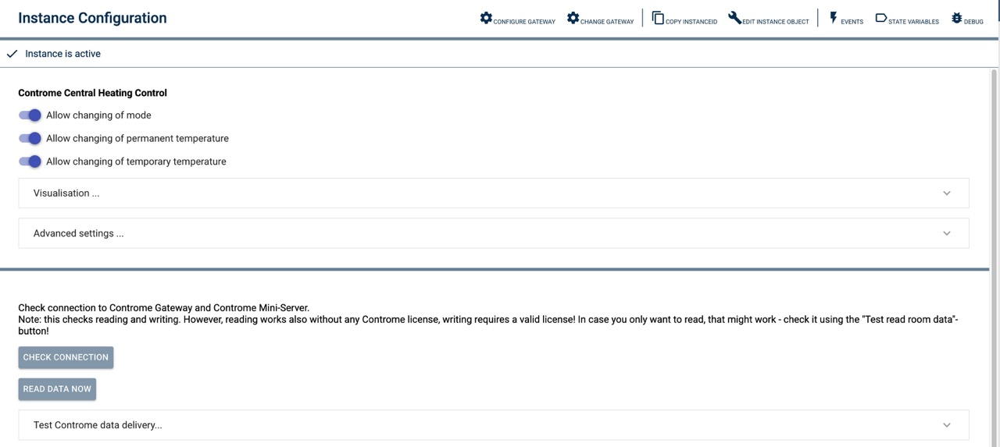

# ContromeCentralControl
Beschreibung des Moduls.

### Inhaltsverzeichnis

1. [Funktionsumfang](#1-funktionsumfang)
2. [Voraussetzungen](#2-voraussetzungen)
3. [Software-Installation](#3-software-installation)
4. [Einrichten der Instanzen in IP-Symcon](#4-einrichten-der-instanzen-in-ip-symcon)
5. [Statusvariablen und Profile](#5-statusvariablen-und-profile)
6. [WebFront](#6-webfront)
7. [PHP-Befehlsreferenz](#7-php-befehlsreferenz)
8. [Lizenz](#8-lizens)

### 1. Funktionsumfang

* Setting of the operation mode
* Setting of (permanent) setpoints
* Setting of temporary setpoints

### 2. Voraussetzungen

- IP-Symcon ab Version 7.1
- Controme API License

### 3. Software-Installation

* Über den Module Store das 'Controme Heating Control'-Modul installieren.
* Alternativ über das Module Control folgende URL hinzufügen https://github.com/AllardLiao/ContromeHeatingControl.git

### 4. Einrichten der Instanzen in IP-Symcon

 Unter 'Instanz hinzufügen' kann die 'ContromeCentralControl'-Instanz mithilfe des Schnellfilters gefunden werden.
 Alternativ ist eine Erstellung über das Controme Gateway Configuration Form möglich.
	- Weitere Informationen zum Hinzufügen von Instanzen in der [Dokumentation der Instanzen](https://www.symcon.de/service/dokumentation/konzepte/instanzen/#Instanz_hinzufügen)

__Konfigurationsseite__:

Name                     | Beschreibung
------------------------ | ----------------------------------------------------------------------------------------
Visualisation...         | Definition, how the visualisation tile will look like and what data will be displayed.
Advanced Settings...     | Automatic updates and their interval

### 5. Statusvariablen und Profile

Die Statusvariablen werden automatisch angelegt. Das Löschen einzelner kann zu Fehlfunktionen führen.

### 6. Visualisierung

### 7. PHP-Befehlsreferenz

* `string CONCC_CheckConnection();`
Checks the connection to the Controme Gateway (IPS) and the Controme Mini-Server.

Beispiel:
`CONCC_CheckConnection();`
Returns JSON:
{
    "success" => success/fail
    "msg" => Information message
    "payload" => addtl. information
}

* `string CONCC_SetRoomTemperature();`
Checks the connection to the Controme Gateway (IPS) and the Controme Mini-Server.

Parameters:
array ["RoomIDs" => ['IDs'], "Target" => temperature]
Note: IDs again is an array.

Beispiel:
`CONCC_SetRoomTemperature(["RoomIDs" => [1, 2, 3], "Target" => 22.1]);`
Returns JSON:
{
    "success" => success/fail
    "msg" => Information message
    "payload" => addtl. information
}

* `string CONCC_setRoomTemperatureTemp();`
Checks the connection to the Controme Gateway (IPS) and the Controme Mini-Server.

Parameters:
array ["RoomIDs" => ['IDs'], "Target" => temperature, 'Duration" => duration in minutes]
Note: IDs again is an array.

Beispiel:
`CONCC_SetRoomTemperatureTemp(["RoomIDs" => [1], "Target" => 24.0, 180]);`
Returns JSON:
{
    "success" => success/fail
    "msg" => Information message
    "payload" => addtl. information
}

* `string CONCC_setRoomMode();`
Checks the connection to the Controme Gateway (IPS) and the Controme Mini-Server.

Parameters:
array ["RoomIDs" => ['IDs'], "ModeID" => 1]
Note: IDs again is an array. ModeID 0..3 (0-Kühlen, 1-Aus, 2-Heizen, 3-An)

Beispiel:
`CONCC_setRoomMode(["RoomIDs" => [1], "ModeID" => 2]);`

Returns JSON:
{
    "success" => success/fail
    "msg" => Information message
    "payload" => addtl. information
}

### 8. Lizens

This project is licensed under the
[Creative Commons Attribution-NonCommercial-ShareAlike 4.0 International License](https://creativecommons.org/licenses/by-nc-sa/4.0/).
