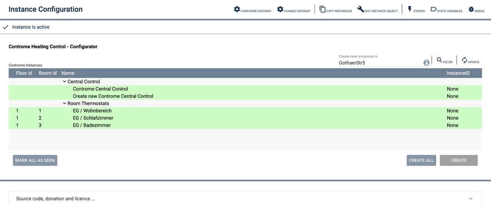

# Controme Configurator

Module description: Gateway for connecting IP-Symcon to the Controme Mini-Server.

## Table of Contents

1. [Features](#1-features)
2. [Requirements](#2-requirements)
3. [Installation](#3-installation)
4. [Instance Setup in IP-Symcon](#4-instance-setup-in-ip-symcon)
5. [Visualization](#6-visualization)
6. [License](#8-license)

## 1. Features

- Creation of Controme IPS Instances

## 2. Requirements

- IP-Symcon version 7.1 or higher
- Controme API license

## 3. Installation

- Add the 'Controme Configurator' instance within "Configurators" folder.

## 4. Instance Setup in IP-Symcon

You can find the 'Controme Configurator' instance using the quick filter under 'Add Configurator Instance' > 'Controme'.

For more information on adding instances, see the [IP-Symcon documentation](https://www.symcon.de/service/dokumentation/konzepte/instanzen/#Instanz_hinzufügen).

__Configuration Page__:

| Name                       | Description                                                                       |
|----------------------------|-----------------------------------------------------------------------------------|
| Target category            | Category where new instances (room thermostat or central control) will be placed  |
| Controme Instances         |                                                                                   |
| - Central Control(s)       | Controme Central Control instances                                                |
| - Room Thermostat(s)       | Room Thermostats to control the setpoint of rooms                                 |
| Button "CREATE"            | Creates an instance from the selected line                                        |
| Button "CREATE ALL"        | Creates all instances that do not exist (marked green)                            |

### 5. Visualisierung

There is not visualisation - only the configuration form:

### 6. Lizenz

This project is licensed under the
[Creative Commons Attribution-NonCommercial-ShareAlike 4.0 International License](https://creativecommons.org/licenses/by-nc-sa/4.0/).
