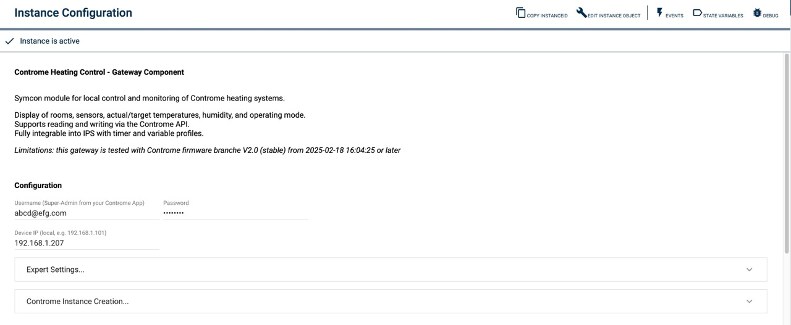

# ContromeSocket
Beschreibung des Moduls.

### Inhaltsverzeichnis

1. [Funktionsumfang](#1-funktionsumfang)
2. [Voraussetzungen](#2-voraussetzungen)
3. [Software-Installation](#3-software-installation)
4. [Einrichten der Instanzen in IP-Symcon](#4-einrichten-der-instanzen-in-ip-symcon)
5. [Statusvariablen und Profile](#5-statusvariablen-und-profile)
6. [WebFront](#6-webfront)
7. [PHP-Befehlsreferenz](#7-php-befehlsreferenz)
8. [Lizenz](#8-lizenz)

### 1. Funktionsumfang

Connection to the Controme Mini-Server

### 2. Voraussetzungen

- IP-Symcon ab Version 7.1
- Controme API license

### 3. Software-Installation

* Über den Module Store das 'Controme Gateway'-Modul installieren.
* Alternativ über das Module Control folgende URL hinzufügen https://github.com/AllardLiao/ContromeHeatingControl.git

### 4. Einrichten der Instanzen in IP-Symcon

 Unter 'Splitter Instanz hinzufügen' kann das 'ContromeGateway' mithilfe des Schnellfilters gefunden werden.
	- Weitere Informationen zum Hinzufügen von Instanzen in der [Dokumentation der Instanzen](https://www.symcon.de/service/dokumentation/konzepte/instanzen/#Instanz_hinzufügen)

__Konfigurationsseite__:

Name                        | Beschreibung
--------------------------- | -----------------------------------------------------------------------------------------------------------
Credentials                 | User account (name / password)
Device IP                   | IP address of the controme mini server, local IP advised (Controme does not support credential encryption)
Expert Settings             |
  - House id                | Identifier of the house - normally 1, but in rare cases (according to Controme) it is 2
  - Use HTTPS               | DO NOT ACTIVATE - currently (Oct 2025) not implemented by Controme
Controme Instance Creation  |
  - Target category         | Category where new instances (room thermostat or central control) will be placed
  - Button "CREATE CC"      | Creates a central control instance
  - List "rooms"            | List of rooms configured in the Controme Mini-Server configuration
  - Button "CREATE RT"      | Creates a room thermostat instance for selected room

### 5. Statusvariablen und Profile

n/a

#### Statusvariablen

n/a

#### Profile

n/a

### 6. Visualisierung

There is not visualisation - only the configuration form:

### 7. PHP-Befehlsreferenz

* `string CONGW_FetchRooms();`
Holt über das Controme API konfigurierte Räumen.

Beispiel:
`CONGW_FetchRooms();`

Return:
JSON encoded list of rooms

* `string CONGW_FetchSystemInfo();`
Holt über das Controme API Systeminformationen des Mini-Servers.

Beispiel:
`CONGW_SystemInfo();`

Return:
JSON encoded system information

* `string CONGW_GetTempDataForRoom(int room-id);`
Holt über das Controme API Daten zu dem Raum mit Nummer room-id vom Controme Mini-Servers.

Beispiel:
`CONGW_SystemInfo();`

Return:
JSON encoded temperature information

* `string CONGW_CheckConnection();`
Checks the connection to the Controme Gateway (IPS) and the Controme Mini-Server.

Beispiel:
`CONGW_CheckConnection();`
Returns JSON:
{
    "success" => success/fail
    "msg" => Information message
    "payload" => addtl. information
}

### 8. Lizenz

This project is licensed under the
[Creative Commons Attribution-NonCommercial-ShareAlike 4.0 International License](https://creativecommons.org/licenses/by-nc-sa/4.0/).
