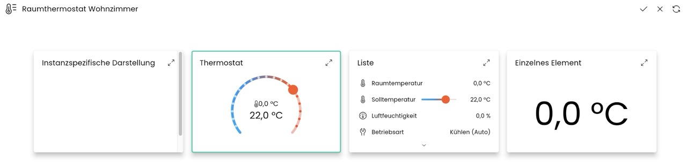

# ContromeRoomThermostat
Beschreibung des Moduls.

### Inhaltsverzeichnis

1. [Funktionsumfang](#1-funktionsumfang)
2. [Voraussetzungen](#2-voraussetzungen)
3. [Software-Installation](#3-software-installation)
4. [Einrichten der Instanzen in IP-Symcon](#4-einrichten-der-instanzen-in-ip-symcon)
5. [Statusvariablen und Profile](#5-statusvariablen-und-profile)
6. [WebFront](#6-webfront)
7. [PHP-Befehlsreferenz](#7-php-befehlsreferenz)
8. [Lizenz](#8-lizenz)

### 1. Funktionsumfang

Darstellung eines Raumthermostats für das Controme-Heizungssystem.

### 2. Voraussetzungen

- IP-Symcon ab Version 7.1
- Controme Mini-Server mit API-Lizenz

### 3. Software-Installation

* Über den Module Store das 'ContromeHeatingControl'-Modul installieren.
* Alternativ über das Module Control folgende URL hinzufügen https://github.com/AllardLiao/ContromeHeatingControl.git

### 4. Einrichten der Instanzen in IP-Symcon

 Unter 'Instanz hinzufügen' kann die 'ContromeRoomThermostat'-Instanz mithilfe des Schnellfilters gefunden werden.
	- Weitere Informationen zum Hinzufügen von Instanzen in der [Dokumentation der Instanzen](https://www.symcon.de/service/dokumentation/konzepte/instanzen/#Instanz_hinzufügen)

__Konfigurationsseite__:

Name                                         | Beschreibung
-------------------------------------------- | -----------------------------------------------------------------------------
Room assignment                              | Floor id, room id, floor name, room name
Advanced settings                            |
  - Automatically update values              | Automatically get values from Controme API / Mini-Server; default = true
  - Update interval                          | Update interval for automatic updates; default = 1 min
Sensor fallback settings                     |
  - Use fallback temperature sensors         | Use fallback sensor for temperature
  - Alternative fixed fallback temperature   | in case fallback sensor is off or not available, set a fix temperature
  - Use fallback humidity sensors            | Use fallback sensor for humidity
  - Alternative fixed fallback humidity      | in case fallback sensor is off or not available, set a fix humidity

### 5. Statusvariablen und Profile

Die Statusvariablen werden automatisch angelegt. Das Löschen einzelner kann zu Fehlfunktionen führen.

#### Statusvariablen

Name              | Typ     | Beschreibung
----------------- | ------- | ----------------------------------------------------------------
Room temperatur   | float   | Temperature of the room
Setpoint          | float   | Setpoint of the room
Humidity          | float   | Humidity of the room
Operation Mode    | int     | Operation mode
Note              | string  | Note, indication e.g. if the backup values are currently taken

#### Profile

Name                  | Typ
--------------------- | -----------------------------------------------------------------
Controme.Betriebsart  | int (0-Kühlen, 1-Aus, 2-Heizen, 3-An) according to Controme-API

### 6. Visualisierung

Standard IP Symcon "Thermostat" visualisation tile.
You might need to swich the appearance in the visualisation setup:

### 7. PHP-Befehlsreferenz

`string CONRT_WriteSetpoint(float SETPOINT);`
Writes the SETPOINT the Controme Mini-Server for the configured room of the instance.

Beispiel:
`CONRT_WriteSetpoint(22.1);`
Returns JSON:
{
    "success" => success/fail
    "msg" => e.g.: "Setpoint set to 22.1 °C"
    "payload" => []
}

`string CONRT_CheckConnection();`
Checks the connection to the Controme Gateway (IPS) and the Controme Mini-Server.

Beispiel:
`CONRT_CheckConnection();`
Returns JSON:
{
    "success" => success/fail
    "msg" => Information message
    "payload" => addtl. information
}

`string CONRT_GetEffectiveTemperature();`
Returns an JSON with information about the temperature of the room.
In case the Controme Mini-Server does not deliver a value, it is taken from the defined Backup-Sensor.

Beispiel:
`CONRT_GetEffectiveTemperature();`
Returns JSON, e.g.:
{
    "success" => success
    "msg" => Temperature for room 1 is 22.1 °C (fallback)
    "payload" => ["RoomID" => 1, "Temperature" => 22.1];
}

`string CONRT_GetEffectiveHumidity();`
Returns an JSON with information about the humidity of the room.
In case the Controme Mini-Server does not deliver a value, it is taken from the defined Backup-Sensor.

Beispiel:
`CONRT_GetEffectiveHumidity();`
Returns JSON, e.g.:
{
    "success" => success
    "msg" => Humidity for room 1 is 46.8%
    "payload" => ["RoomID" => 1, "Humidity" => 46.8];
}

NOTE:
The returned JSON include also a "salt" string leading the keys, e.g. "RW88_" => "RW88_success"

### 8. Lizenz

This project is licensed under the
[Creative Commons Attribution-NonCommercial-ShareAlike 4.0 International License](https://creativecommons.org/licenses/by-nc-sa/4.0/).
