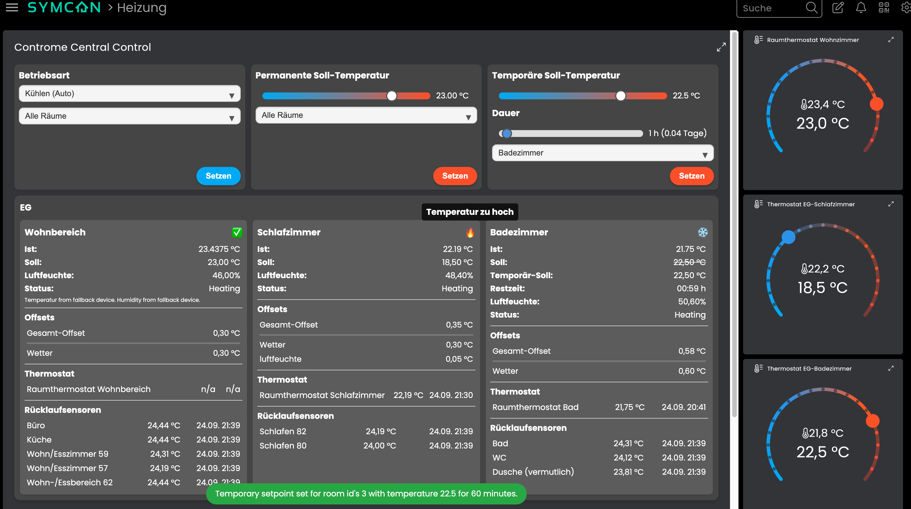

# Controme Heating Control

Folgende Module beinhaltet das Controme Heating Control Repository:

- __Controme Gateway__ ([Documentation](ContromeGateway))
- __Controme Central Control__ ([Documentation](ContromeCentralControl))
- __Controme Room Thermostat__ ([Documentation](ContromeRoomThermostat))

IP-Symcon Modul zur lokalen Steuerung und Überwachung von Controme-Heizsystemen.

Automatisches Anlegen von Räumen, Sensoren, Ist-/Soll-Temperaturen, Luftfeuchte und Betriebsart.

Unterstützt Lesen und Schreiben über die Controme API - V2 Branch.
API Informatiaon can be found at https://support.controme.com/api/
HINWEIS: Entwickelt in der V2 Branch von Controme OS - Kompatibilität mit V1 nicht gewährleiste.

Vollständig in IPS integrierbar mit Timer, Variablenprofilen, Tiles für die Visualisierung.



## Installation

Erstelle zuerst eine Controme Gateway-Instanz als Splitter-Instanz und konfiguriere diese.
Das Gateway stellt die Verbindung zum Controme Mini-Server her.

Als nächstes erstelle eine Konfigurator-Instanz (im Baum unter den Konfiguratoren) und verbinde diese mit dem erstellen Controme-Gateway.

Aus der Konfigurator-Instanz können nun die zwei Typen von Kontroll-Geräten erstellt werden:
Zentrale Steuereinheit(en) und (je Raum ein) Raum-Thermostat(e).

Mehrere zentrale Steuereinheiten sind möglich - hierüber können End-User Steuerungen mit unterschiedlichen
Berechtigungen erzeugt werden - wie z.B. das Umschalten zwischen Heiz- und Kühl-Betrieb in der einen Instanz
möglich, in der anderen nicht.

```
Controme Gateway (type=2, parent)
    |
    ├── Controme Configurator (type=4, child)
    |
    ├── Controme Central Control #1 (type=3, child)
    |
    ├── Controme Room Thermostat #1 (type=3, child)
    |
    ├── Controme Room Thermostat #2 (type=3, child)
    .
    .
    .
```

Hinweise:
Die Configuration und Benennung der Räume und Sensoren im Controme Mini-Servers sollten final abgeschlossen sein.
Wird dies nach Verbindung dieses Moduls in der Controme-App angepasst, ändern sich die Namen Räume in der Konfigurator-Instanz und werden ggf. nicht korrekt als schon angelegt erkannt.

## License

This project is licensed under the [CC BY-NC-SA 4.0 License](https://creativecommons.org/licenses/by-nc-sa/4.0/).

### Third-party Licenses

- This module uses **traits from the [StylePHP](https://github.com/symcon/StylePHP) project** by Symcon GmbH,
  licensed under [CC BY-NC-SA 4.0](https://creativecommons.org/licenses/by-nc-sa/4.0/).

- This module uses **traits from Heiko Wilknitz** ([wilkware.de](https://wilkware.de)),
  licensed under [CC BY-NC-SA 4.0](https://creativecommons.org/licenses/by-nc-sa/4.0/).

## Credits & Acknowledgments

This project was developed to integrate **Controme Smart Heating** systems into IP-Symcon.
Special thanks to:

- **Controme GmbH** ([controme.com](https://www.controme.com)) for review of the project. API Informatiaon can be found at https://support.controme.com/api/
- **Symcon GmbH** for IP-Symcon and the [StylePHP](https://github.com/symcon/StylePHP) project, which served as a basis for parts of this module.
- **Heiko Wilknitz** ([wilkware.de](https://wilkware.de)) for providing open-source traits under [CC BY-NC-SA 4.0](https://creativecommons.org/licenses/by-nc-sa/4.0/).

This module is an independent community project and is not officially affiliated with or endorsed by Controme GmbH nor by Symcon GmbH.
